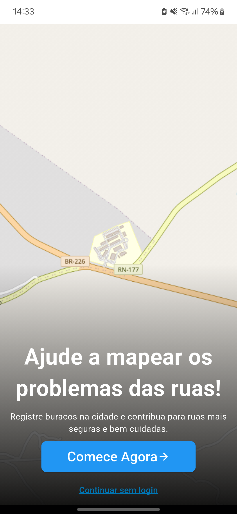
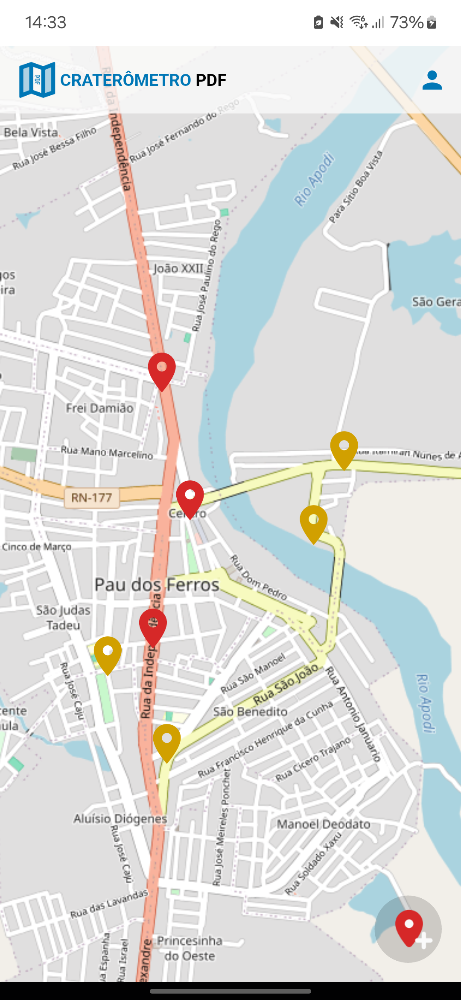
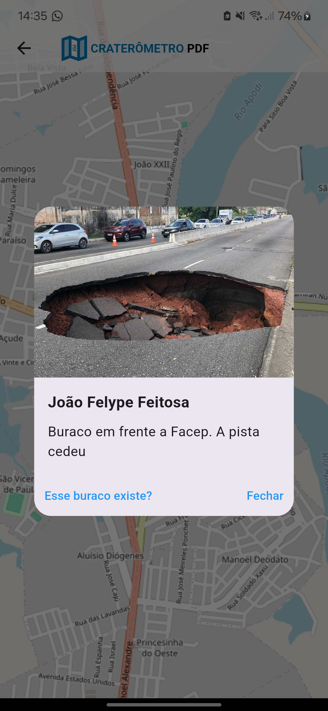

# Craterômetro

Craterômetro é um aplicativo que permite aos usuários cadastrarem-se e reportarem buracos nas ruas da cidade de Pau dos Ferros. O objetivo é facilitar a identificação de problemas urbanos e contribuir para a melhoria da infraestrutura local.

## 📱 Funcionalidades

- Cadastro e login de usuários
- Relato de buracos com fotos e localização
- Visualização de buracos reportados no mapa
- Sistema de notificações

## 🚀 Tecnologias Utilizadas

- **Flutter** 3.27.3 (channel stable)  
- **Dart** 3.6.1
- **Firebase** (Autenticação, Firestore, Storage, e Cloud Functions)

## 🛠️ Como Rodar o Projeto (Sem Flutter)

1. Baixe o APK em
    ```bash
    https://github.com/Vet0r/craterometro/releases/tag/1.0
    ```


## 🛠️ Como Rodar o Projeto

1. Clone o repositório:
   ```bash
   git clone https://github.com/Vet0r/craterometro.git
   ```
2. Acesse o diretório do projeto:
   ```bash
   cd craterometro
   ```
3. Instale as dependências:
   ```bash
   flutter pub get
   ```
4. Execute o aplicativo:
   ```bash
   flutter run
   ```


## 📸 Screenshots






## 📜 Licença

Este projeto está licenciado sob a MIT License - veja o arquivo [LICENSE](LICENSE) para mais detalhes.

